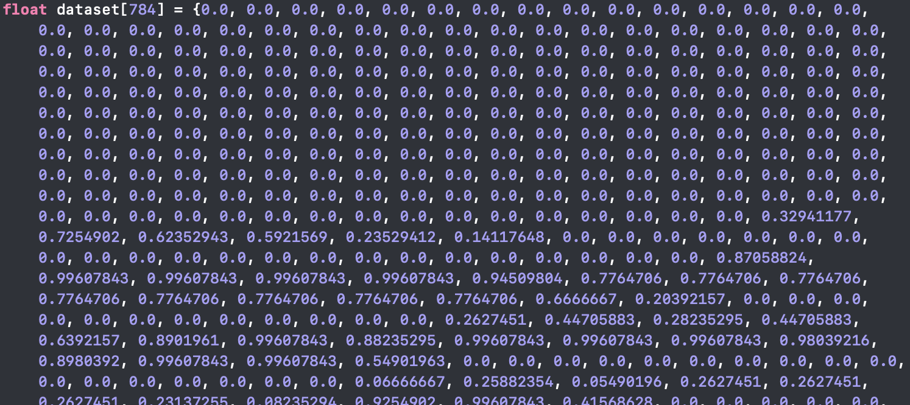
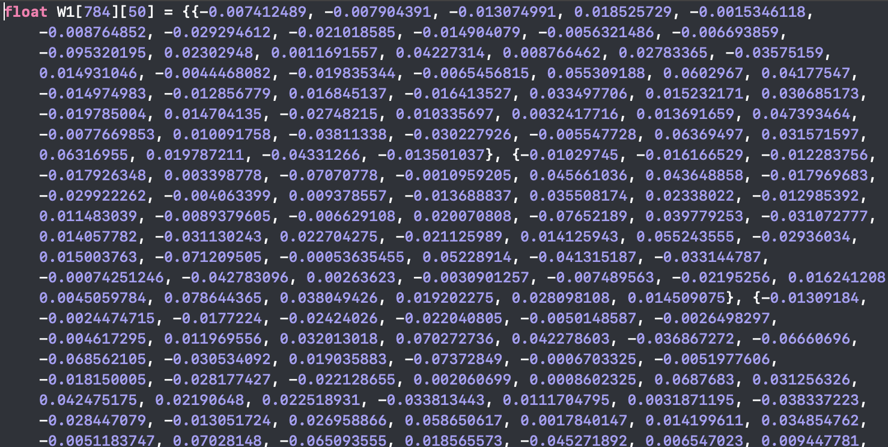

# ベアメタルでDeep Learning

## 概要

このコードはセキュリティ・キャンプ2018の集中開発コースの「BareMetalで遊ぼうゼミ」で書いたものです。3日間かけて開発を行ったのですが、べメタルでMNISTの推論処理まではできなかったのですが、今回のような貴重な体験を残したいと思い公開しました。  
ベアメタルとは、OSやライブラリOSやライブラリが無い素のハードウェアのことで、OSが無いところで開発することをベアメタル開発といいます。今回はRapsberry Piを対象として開発を行いました。

## 準備

私はビルド用に、ubuntu18.04で環境構築をしました。

### クロス開発環境を構築
#### crosstool-NGのビルド

必要なパッケージをインストール
```
sudo apt install -y build-essential git python libzip-dev automake libncurses5 libncurses5-dev gperf bison flex gawk libtool libtool-bin expat libexpat-dev texinfo help2man python-dev emacs
```
crosstool-ngのソースをダウンロード
```
wget http://crosstool-ng.org/download/crosstool-ng/crosstool-ng-1.23.0.tar.bz2
```
インストール用のディレクトリを作成
```
mkdir $HOME/opt
```
解凍して、ビルド、インストール（数時間かかりました）
```
tar jxf crosstool-ng-1.23.0.tar.bz && cd crosstool-ng-1.23.0
./configure --prefix=$HOME/opt
make && make install
```
パスを通す
```
echo 'export PATH="$PATH:$HOME/opt/bin"' >> ~/.bashrc
```
以上

#### crosstool-NGを使ったクロス開発環境の構築

準備
```
mkdir $HOME/ctng
mkdir $HOME/src
cd $HOME/ctng
```
サンプルconfigの作成
```
ct-ng arm-unknown-eabi
```
設定画面を開く
```
ct-ng menuconfig
```
以下の設定を行う
- MMUを無効化
  - Target options ---> Use the MMU のチェックを外す
- アーキテクチャの設定
  - Target options ---> Emit assembly for CPU をarm1176jzf-sに設定
- システムコール実装の無効化
  - C-library ---> Disable the syscalls supplied with newlib のチェックされてるのを確認
- gdbのビルドを有効化
  - Debug facilities ---> gdbのところでspace押してチェック  

終わったらSaveしてExit  
最後にビルドする（数時間かかる）
```
ct-ng buid
```
パスを通す
```
echo 'export PATH="$PATH:$HOME/x-tools/arm-unknown-eabi/bin"' >> ~/.bashrc
```
以上でクロス開発環境構築終了

### データの準備

ライセンスの都合上、MNISTの画像データと重みパラメータは公開してません。そのため、以下の2つのファイルを作成する。
- data.h
- mnist.h  

data.hには推論させたい画像データの変数、mnist.hには重みパラメータの変数を下図のようにそれぞれ記す。    

・data.hの例


・mnist.hの例



## ビルドの仕方

```
make
```
以上

## 使い方

ビルドするとmyprog.elfが生成される。それをRapsberry Piのメモリーカードにいれる。

## ライセンス

mitライセンスを使用しています。
# seccamp2018-baremetal
